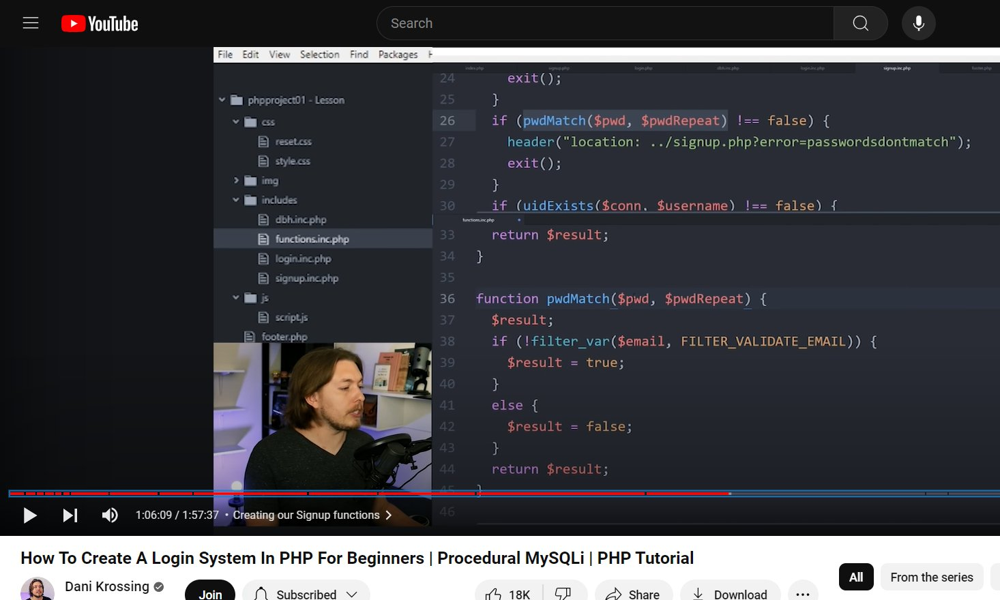

<link rel="stylesheet" href="notes/css/style.css">

| **Tutorial Name**    | **How To Create A Login System In PHP For Beginners     \| Procedural MySQLi** |
| -------------------- | ------------------------------------------------------------------------------ |
| Platform             | YouTube                                                                        |
| Channel              | [Dani Krossing](https://www.youtube.com/@Dani_Krossing)                        |
| Course/Tut Year      | 2020                                                                           |
| File Name            | README.md                                                                      |
| Date Repo Created    | 07/29/24                                                                       |
| Date Modified        | --                                                                             |
| Version              | 00.01.00                                                                       |
| Programmer / Student | **Eric Hepperle**                                                              |

 

### TUTORIAL / COURSE URL

- https://www.youtube.com/watch?v=gCo6JqGMi30&t=0s

### GITHUB REPO

- https://github.com/codewizard13/ehw-tut--dk-login-system

### TECHNOLOGIES

  

 

## TAGS

`Tutwrk` `Dani Krossing` `YouTube` `PHP` `Coding` `Project Based` `LAMP` `MySQL` `Project-Based`

## PURPOSE

Learn PHP / MySQL from scratch by following tutorial by YouTube channel **[Dani Krossing](https://www.youtube.com/@Dani_Krossing)** This is a complete procedural PHP tutorial where you will learn how to create a login system in PHP from, and how to show content after being logged in. You will also learn about error handlers, and MySQL databases, which includes how to make a login form and a signup form.

### Tutorial Info

Tutorial Info:
- Title: How To Create A Login System In PHP For Beginners | Procedural MySQLi | PHP Tutorial
- Full URL: https://www.youtube.com/watch?v=gCo6JqGMi30&t=0s
- Base URL: https://www.youtube.com/watch?v=gCo6JqGMi30
- Channel: Dani Krossing
- Channel URL: https://www.youtube.com/@Dani_Krossing
- Avatar URL: https://yt3.ggpht.com/ytc/AIdro_mSeayItmvVFloCRPRp-DIy2zt9uqfPHRfycx8CXGBAMvc=s88-c-k-c0x00ffffff-no-rj

## NOTES

Notes are located in [./notes/main.md](./notes/main.md)

## RESOURCES & REFERENCE

- Good **Color Names** and Shades website: https://www.html-color-names.com/lightgreen.php
- [Ascii Characters](https://www.ascii-code.com/): Find the cross-type divide symbol here