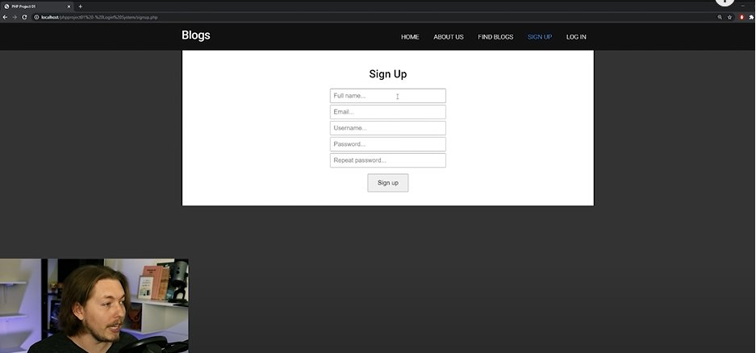
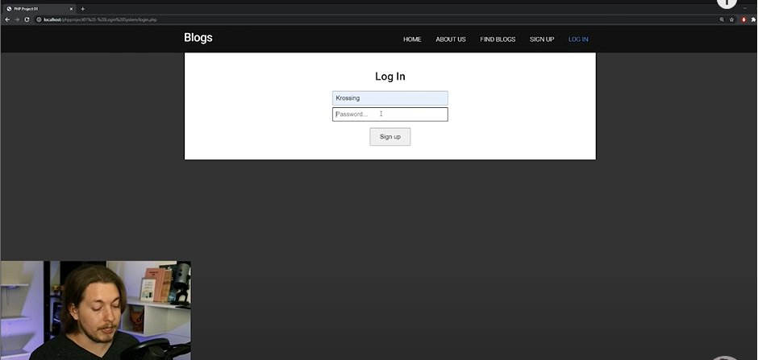
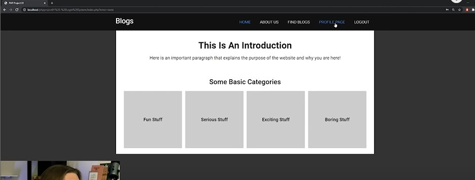

<link rel="stylesheet" href="css/style.css" />

# TUTORIAL NOTES

<a id="top-bookmark-btn" class="bookmark-link" href="#bookmark">JUMP TO BOOKMARK</a>

### CH 1. 00:00:00 - Introduction


### CH 2. 00:01:16 - How to get my lesson files

- On Patreon
- He's including the CSS there because it will take up valueable tutorial time to put it here
- #GOTCHA: Patreon costs $$$

### CH 3. 00:02:11 - What will you learn in this video?

- We **WILL** build a fully-working **login system** in this video. Just know that it isn't possible to teach a commercial version without getting into more advanced PHP. I want to keep this video beginner-friendly and simple.

### CH 4. 00:02:48 - What security will we use?

- We will use **prepared statements**

### CH 5. 00:03:41 - It's Procedural PHP, not OOP PHP


### CH 6. 00:04:14 - If you get a error along the way...


### CH 7. 00:04:48 - A demonstration of what we will make








### CH 8. 00:08:20 - What YOU should have ready before we start!

!!! #GOTCHA: It takes a few minutes to rebuild what he has from scratch.

- This is the **Google Fonts** code I came up with in 2024:

```html
<link rel="preconnect" href="https://fonts.googleapis.com">
<link rel="preconnect" href="https://fonts.gstatic.com" crossorigin>
<link href="https://fonts.googleapis.com/css2?family=Roboto:ital,wght@0,100;0,300;0,400;0,500;0,700;0,900;1,100;1,300;1,400;1,500;1,700;1,900&display=swap" rel="stylesheet">
```

- Following [this tut](https://www.youtube.com/watch?v=5e0wuvhxLk4) to create the **reset.css** file

#### Three most popular reset.css options

- **Meyerweb**: https://meyerweb.com/eric/tools/css/reset/
- **Normalize.css**: https://byby.dev/normalize-css
- **The New CSS Reset**: https://css-tricks.com/an-interview-with-elad-shechter-on-the-new-css-reset/#top-of-site

- WE will be using the **new CSS reset**
- This is what I ended up with:

**File: reset.css**

```css
/* RESETS all styles so overrides default browser styling
 for all the different browsers. */

/*** The new CSS Reset - version 1.2.0 (last updated 23.7.2021) ***/

/* Remove all the styles of the "User-Agent-Stylesheet", except for the 'display' property */
*:where(:not(iframe, canvas, img, svg, video):not(svg *)) {
  all: unset;
  display: revert;
}

/* Preferred box-sizing value */
*,
*::before,
*::after {
  box-sizing: border-box;
}

/*
  Remove list styles (bullets/numbers)
  in case you use it with normalize.css
*/
ol,
ul {
  list-style: none;
}

/* For images to not be able to exceed their container */
img {
  max-width: 100%;
}

/* Removes spacing between cells in tables */
table {
  border-collapse: collapse;
}

/* Revert the 'white-space' property for textarea elements on Safari */
textarea {
  white-space: revert;
}
```

### CH 9. 00:12:52 - Creating our Header and Index pages

- Ref: https://youtu.be/HkNNyDtm7mg?si=fvpjh1UjjHDiMM2U&t=287
- Created SVG logo "Blogs" here: https://boxy-svg.com/

!!! #GOTCHA: He says his `script.js` file is only for changing active menu link color when page changes, but could not find his code. Skipping for now

- The complete working index.php file:

**File: index.php**

```php
<?php
include_once 'includes/dbh.inc.php';
?>

<!DOCTYPE html>
<html lang="en">

<head>
  <meta charset="UTF-8">
  <meta name="viewport" content="width=device-width, initial-scale=1.0">
  <title>Login System | Home</title>
  <link rel="preconnect" href="https://fonts.googleapis.com">
  <link rel="preconnect" href="https://fonts.gstatic.com" crossorigin>
  <link
    href="https://fonts.googleapis.com/css2?family=Roboto:ital,wght@0,100;0,300;0,400;0,500;0,700;0,900;1,100;1,300;1,400;1,500;1,700;1,900&display=swap"
    rel="stylesheet">
  <link rel="stylesheet" href="css/reset.css">
  <link rel="stylesheet" href="css/main.css">
  <!-- dk-style.css NOT connected -->
</head>

<body>

  <!-- .header-main -->
  <header class="header-main">
    <nav>
      <div class="wrapper">
        <a href="index.php">
          
        </a>
        <ul>
          <li><a href="index.php">Home</a></li>
          <li><a href="discover.php">About Us</a></li>
          <li><a href="blog.php">Find Blogs</a></li>
          <li><a href="signup.php">Sign up</a></li>
          <li><a href="login.php">Log in</a></li>
        </ul>
      </div>
    </nav>
  </header>
  <!-- // .header-main -->

  <!-- .wrapper -->
  <main class="wrapper">

    <section class="index-intro">
      <h1>This is an Introduction</h1>
      <p>Here is an important paragraph that explains the purpose of the website.</p>
    </section>

    <section class="index-categories">
      <h2>Some Basic Categories</h2>

      <!-- .index-categories-list -->
      <div class="index-categories-list">

        <div class="cat-box">
          <h3>Fun Stuff</h3>
        </div>
        <div class="cat-box">
          <h3>Serious Stuff</h3>
        </div>
        <div class="cat-box">
          <h3>Exciting Stuff</h3>
        </div>
        <div class="cat-box">
          <h3>Boring Stuff</h3>
        </div>


      </div>
      <!-- // .index-categories-list -->

    </section>

  </main>
  <!-- // .wrapper -->

</body>

</html>

<script src="js/script.js"></script>
```

!!! #GOTCHA: When creating the `header.php` file, the opening `main.wrapper` must be included. Also, `footer.php` should start with the ending `main.wrapper` div tag.


### CH 10. 00:15:57 - Creating our Signup and Login pages


### CH 11. 00:26:43 - Creating a connection to our database


### CH 12. 00:33:16 - Creating our database


### CH 13. 00:42:23 - Creating our Signup script


### CH 14. 00:58:23 - Creating our Signup functions


### CH 15. 00:58:23 - Testing our Signup system


### CH 16. 01:24:46 - Creating Signup page error messages


### CH 17. 01:26:47 - Creating our Login script


### CH 18. 01:36:35 - Creating our Login functions


### CH 19. 01:46:22 - Creating Login page error messages


### CH 20. 01:47:47 - Changing our website when user is logged in


### CH 21. 01:51:19- Testing our Login system


### CH 22. 01:52:20 - Creating our Logout script


### CH 23. 01:54:12 - Creating a welcome message when logged in


### CH 24. 01:54:44 - Outro

---

<a id="bookmark" href="#top-bookmark-btn" title="back to top">BOOKMARK</a>
---


