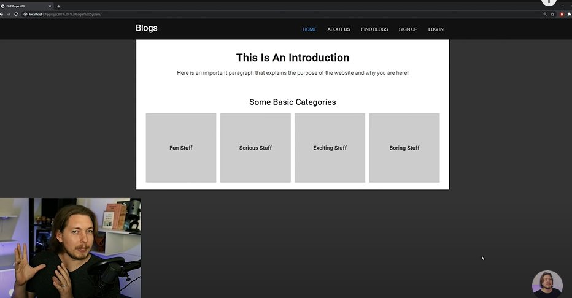

<link rel="stylesheet" href="css/style.css" />

# TUTORIAL NOTES

<a id="top-bookmark-btn" class="bookmark-link" href="#bookmark">JUMP TO BOOKMARK</a>

### CH 1. 00:00:00 - Introduction


### CH 2. 00:01:16 - How to get my lesson files

- On Patreon
- He's including the CSS there because it will take up valueable tutorial time to put it here
- #GOTCHA: Patreon costs $$$

### CH 3. 00:02:11 - What will you learn in this video?

- We **WILL** build a fully-working **login system** in this video. Just know that it isn't possible to teach a commercial version without getting into more advanced PHP. I want to keep this video beginner-friendly and simple.

### CH 4. 00:02:48 - What security will we use?

- We will use **prepared statements**

### CH 5. 00:03:41 - It's Procedural PHP, not OOP PHP


### CH 6. 00:04:14 - If you get a error along the way...


### CH 7. 00:04:48 - A demonstration of what we will make




### CH 8. 00:08:20 - What YOU should have ready before we start!

!!! #GOTCHA: It takes a few minutes to rebuild what he has from scratch.

- This is the **Google Fonts** code I came up with in 2024:

```html
<link rel="preconnect" href="https://fonts.googleapis.com">
<link rel="preconnect" href="https://fonts.gstatic.com" crossorigin>
<link href="https://fonts.googleapis.com/css2?family=Roboto:ital,wght@0,100;0,300;0,400;0,500;0,700;0,900;1,100;1,300;1,400;1,500;1,700;1,900&display=swap" rel="stylesheet">
```


### CH 9. 00:12:52 - Creating our Header and Index pages


### CH 10. 00:15:57 - Creating our Signup and Login pages


### CH 11. 00:26:43 - Creating a connection to our database


### CH 12. 00:33:16 - Creating our database


### CH 13. 00:42:23 - Creating our Signup script


### CH 14. 00:58:23 - Creating our Signup functions


### CH 15. 00:58:23 - Testing our Signup system


### CH 16. 01:24:46 - Creating Signup page error messages


### CH 17. 01:26:47 - Creating our Login script


### CH 18. 01:36:35 - Creating our Login functions


### CH 19. 01:46:22 - Creating Login page error messages


### CH 20. 01:47:47 - Changing our website when user is logged in


### CH 21. 01:51:19- Testing our Login system


### CH 22. 01:52:20 - Creating our Logout script


### CH 23. 01:54:12 - Creating a welcome message when logged in


### CH 24. 01:54:44 - Outro

---

<a id="bookmark" href="#top-bookmark-btn" title="back to top">BOOKMARK</a>
---


